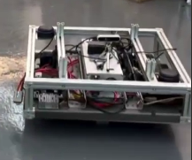

# AMR Hardware Interface
## AMR Hardware Interface

The AMR Hardware Interface package is a ROS2 package that provides a hardware interface for an Autonomous Mobile Ground Robot (AMR). This package allows seamless communication between the robot's hardware components and the ROS2 ecosystem.

## Features

- Control and monitor the AMR's hardware components
- Interface with sensors, actuators, and other peripherals
- Support for real-time control and feedback
- Easy integration with other ROS2 packages

## Installation

1. Clone this repository into your ROS2 workspace:
    
    git clone https://github.com/Sardor06/amr_hardware_interface.git
    

2. Build the package using colcon:
    
    cd <path_to_your_ros2_workspace>
    colcon build
    

## Usage

1. Launch the AMR Hardware Interface node:
    
    ros2 launch amr_hardware_interface amr_hardware_interface.launch.py
    

2. Use the provided ROS2 interfaces to control and monitor the AMR's hardware components.

## Configuration

The AMR Hardware Interface package provides a configuration file `amr_hardware_interface.yaml` where you can specify the hardware configuration and settings. Make sure to update this file according to your specific hardware setup.

## Contributing

Contributions to the AMR Hardware Interface package are welcome! If you encounter any issues or have suggestions for improvements, please open an issue on the [GitHub repository](https://github.com/Sardor06/amr_hardware_interface/issues).

## License

This package is licensed under the MIT License. See the [LICENSE](LICENSE) file for more details.

## Contact

For any inquiries or further information, please contact the package maintainer at [sardoratamuradov2006@gmail.com](sardoratamuradov2006@gmail.com).